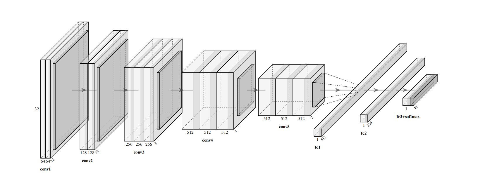
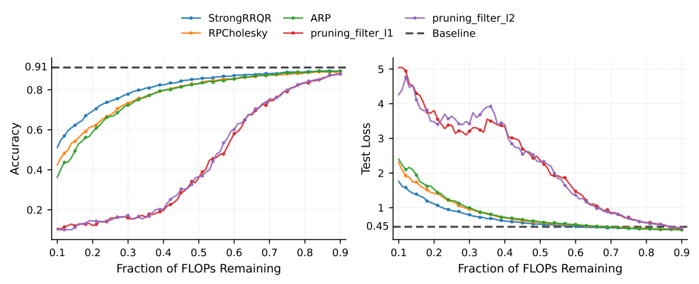
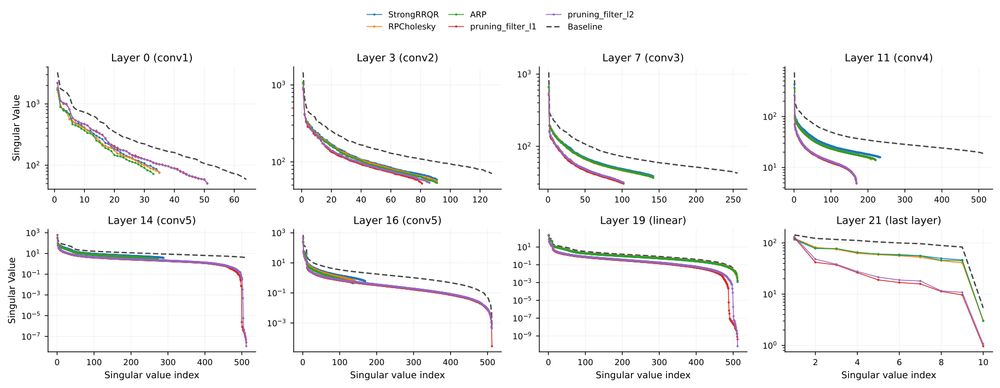

# Spring 2026 Semester Project - Column subset selection methods in NLA with application to neural networks pruning

## Overview

Our pruning approach is built upon **column subset selection (CSS)**, a classical **low-rank approximation** technique from **numerical linear algebra**. By selecting informative columns from weight matrices, the method preserves their essential structure and achieves **structured pruning** through the reduction of layer or channel dimensions. This structured design makes the approach naturally compatible with other model compression techniques, including **knowledge distillation** and **quantization**.

Therefore, it is particularly well suited to real-world deployment scenarios involving **edge devices**, **mobile platforms**, **embedded AI systems**, and other resource-constrained environments where inference efficiency and hardware-aware model design are of central importance. This project is motivated by the framework proposed by Chee et al. in [Model Preserving Compression for Neural Networks](https://proceedings.neurips.cc/paper_files/paper/2022/file/f8928b073ccbec15d35f2a9d39430bfd-Paper-Conference.pdf), and further explores alternative pruning strategies in this context.

## Key Features

* **Structured pruning via Column Subset Selection (CSS)**

* **Multiple CSS algorithms from Numerical Linear Algebra**

* **Iterative adaptive pruning strategy**

* **Structured low-rank approximation of activation matrices**

* **Effective downstream error correction**

* **Hardware-friendly model compression**


## Experimental Results

Experiments were conducted on VGG-16 trained on CIFAR-10. The baseline model achieved **91.13% classification accuracy** before compression.

Key findings include:

* Under **FLOPs constraints**, CSSP-based pruning methods consistently outperform classical $\ell_1/\ell_2$ filter pruning, achieving higher accuracy, lower test loss, and smoother degradation as compression becomes more aggressive.


* CSSP-based pruning preserves the singular value spectra of activation matrices more faithfully than conventional pruning methods, indicating better preservation of the underlying representation subspaces.


* Experiments reveal a **discernible trend** of rank degradation during pruning: representation collapse typically begins in deeper convolutional blocks and progressively propagates to downstream linear layers and earlier convolutional blocks. CSSP-based methods significantly mitigate this effect. (see [filter pruning](https://github.com/yuekai-yan/CSSP_Neural_Networks_Pruning/blob/main/fig/layers_vary_flops_normalized.pdf) and [magnitude pruning](https://github.com/yuekai-yan/CSSP_Neural_Networks_Pruning/blob/main/fig/layers_vary_params_normalized.pdf))

## Folder Structure
```
├── CSSP                       # This directory contains all the CSSP techniques in the project
│   ├── ARP.py
│   ├── RPCholesky.py
│   ├── StrongRRQR.py
├── Pruning                    # This directory contains all the pruning techniques in the project
│   ├── magnitude_pruning.py
│   ├── pruning_CSSP.py
│   └── pruning_filter.py
├── fig                        # This directory contains all the figures in the project
├── saved model and data       # This directory contains the pretrained baseline model for CIFAR10
├── CIFAR10.ipynb              # This script contains the experiments on CIFAR-10
├── MNIST.ipynb                # This script contains the experiments on MNIST
├── Plot.py                    # This script is used to plot all the figures in the project
├── model.py                   # This script contains the VGG-16 architecture for CIFAR-10
```